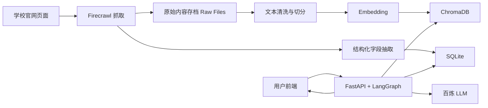
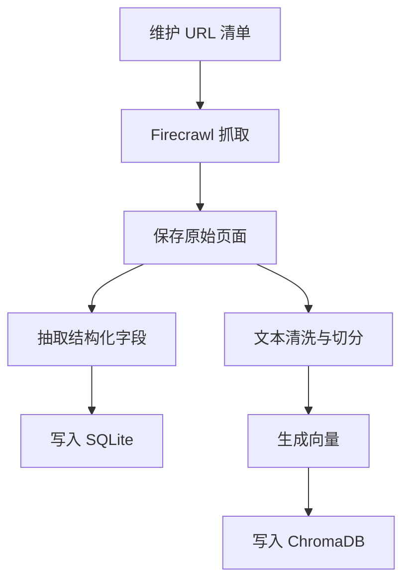
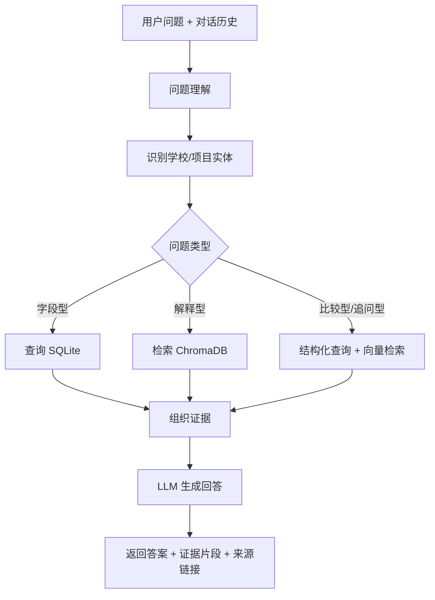

# GlobalStudy AI 技术方案

## 1. 项目概述

### 1.1 项目名称
- GlobalStudy AI
- 留学项目智能咨询助手

### 1.2 项目目标
面向留学申请场景，构建一个本地运行的毕业设计级 Demo。系统聚焦 QS 前 50 院校中的 10 到 15 所代表性学校的硕士项目，为用户提供基于学校官网信息的智能问答服务，并保证回答结果具备可溯源能力。

### 1.3 核心价值
- 消除留学信息差
- 基于学校官网提供准确的项目信息
- 通过 RAG 提供带证据的智能回答
- 以尽可能精简的架构完成完整闭环

### 1.4 范围边界

本期纳入范围：
- 只覆盖 10 到 15 所代表性学校
- 只使用学校官网页面作为数据来源
- 支持手动触发数据抓取与知识库重建
- 支持多轮问答
- 回答结果展示原文证据片段与原始链接

本期不纳入范围：
- 用户登录和历史记录持久化
- 后台管理系统
- 自动定时更新
- 个性化选校推荐
- 自动打分或申请结果预测

## 2. 技术选型

### 2.1 选型原则
- 架构尽可能轻量，适合本地运行
- 优先保证准确性和可溯源性
- 兼顾毕业设计展示效果与实现复杂度
- 避免过度设计

### 2.2 最终方案
采用“结构化数据 + 文本 RAG”的混合架构。

原因如下：
- 对学费、学制、语言要求、截止时间等字段型问题，结构化查询更稳定
- 对项目介绍、课程特色、申请说明等解释型问题，文本检索更合适
- 多轮追问和项目对比可以同时利用结构化数据与原文检索结果
- 相比纯文本 RAG，准确性更高
- 相比多 Agent 复杂编排，系统更稳定、更容易实现和答辩说明

### 2.3 技术栈
- 后端：Python + FastAPI
- 工作流编排：LangGraph
- 向量数据库：ChromaDB
- 结构化存储：SQLite
- 抓取工具：Firecrawl API
- 主对话模型：阿里云百炼 LLM
- Embedding 模型：阿里云百炼 `text-embedding-v3`
- 前端：HTML + CSS + JavaScript
- 本地运行方式：单机本地启动

说明：
- 百炼作为默认模型服务提供方
- 硅基流动只保留为后续兼容扩展接口，不作为第一版主路径

## 3. 总体架构设计

### 3.1 架构概览
系统采用单体架构，内部划分为四个清晰模块：
- 数据采集模块
- 知识库构建模块
- 问答服务模块
- 前端展示模块



### 3.2 模块划分

#### 3.2.1 数据采集模块
职责：
- 根据预先维护的学校和项目页面 URL 列表抓取学校官网内容
- 将抓取结果保存为本地原始文件
- 为后续结构化抽取和文本切分提供输入

输出：
- 原始 Markdown 或 HTML 文件
- 页面级元数据，例如学校名、页面标题、URL、抓取时间

#### 3.2.2 知识库构建模块
职责：
- 从原始页面中抽取项目结构化字段
- 将结构化字段写入 SQLite
- 将页面正文切分为可检索 chunk
- 调用 embedding 模型生成向量后写入 ChromaDB

#### 3.2.3 问答服务模块
职责：
- 接收用户问题和上下文
- 对问题进行意图识别和实体识别
- 在结构化查询和向量检索之间进行路由
- 组织证据并生成最终回答

#### 3.2.4 前端展示模块
职责：
- 提供多轮对话界面
- 展示回答内容
- 展示证据片段和原始来源链接
- 展示错误提示与无结果提示

### 3.3 部署形态
为保证演示简单，前后端都在本地运行：
- FastAPI 提供 API 服务
- FastAPI 同时托管前端静态资源
- SQLite 和 ChromaDB 均以本地文件形式持久化
- 数据抓取和建库通过本地命令手动触发

该方案无需额外服务器，适合毕业设计答辩环境。

## 4. 数据设计

### 4.1 数据来源约束
所有数据仅来自学校官网，主要包括：
- 项目介绍页
- 入学要求页
- 学费页
- 申请截止时间页
- 语言要求页

不使用第三方留学中介、论坛或聚合网站数据。

### 4.2 数据采集策略
由于不同学校网站结构差异较大，第一版采用“人工维护入口 URL + 自动抓取”的方式。

流程如下：
1. 人工整理学校与项目入口链接
2. Firecrawl 按 URL 抓取页面
3. 保存原始内容到本地
4. 对抓取失败页面记录日志并允许重新执行

这样做的原因：
- 可控性更强
- 避免全站爬取带来的噪声
- 更适合 10 到 15 所学校的样本库建设

### 4.3 结构化数据模型
为提升字段型问答准确性，系统维护本地结构化项目表。

建议核心表如下。

#### `projects`
- `id`
- `school_name`
- `school_country`
- `program_name`
- `degree_type`
- `department`
- `study_mode`
- `duration`
- `tuition`
- `application_deadline`
- `language_requirement`
- `academic_requirement`
- `overview`
- `last_verified_at`

#### `source_pages`
- `id`
- `project_id`
- `page_type`
- `page_title`
- `source_url`
- `raw_file_path`
- `content_hash`
- `fetched_at`

#### `field_evidences`
- `id`
- `project_id`
- `field_name`
- `field_value`
- `evidence_text`
- `source_page_id`

设计说明：
- `projects` 保存统一字段，便于直接查询
- `source_pages` 保存页面级来源信息，支撑可溯源
- `field_evidences` 保存结构化字段对应的证据片段，避免“字段有值但解释不清来源”

### 4.4 向量数据设计
向量库使用 ChromaDB，每个 chunk 至少包含以下元数据：
- `project_id`
- `school_name`
- `program_name`
- `page_type`
- `page_title`
- `source_url`
- `chunk_index`

chunk 内容来源于学校官网原文，便于回答时直接引用原句或近似原句。

### 4.5 原始文件组织
建议保留原始抓取文件，目录类似如下：

```text
data/
  raw/
    oxford/
      msc-computer-science.md
      admission.md
    imperial/
      msc-ai.md
  processed/
    projects.json
    field_evidences.json
```

这样做有两个好处：
- 方便排查抽取错误
- 方便答辩时展示数据来源链路

## 5. 知识库构建流程

### 5.1 总流程



### 5.2 结构化字段抽取策略
考虑到学校官网页面格式不统一，字段抽取采用“LLM 抽取 + 证据保留”的方式。

具体策略：
- 输入：项目页面原始 Markdown
- 输出：符合预定义 JSON Schema 的字段对象
- 同时抽取每个字段对应的证据文本
- 字段不存在时明确输出 `null`

例如：
- `tuition`
- `application_deadline`
- `language_requirement`
- `duration`

这样可以减少直接依赖正则或页面结构，适应不同学校网页模板。

### 5.3 文本切分策略
为兼顾检索准确率和证据可读性，文本切分建议遵循以下原则：
- 优先按标题和段落切分
- 避免将过长页面直接粗暴平均切分
- 单个 chunk 保持在适合 embedding 的长度范围
- chunk 之间保留少量重叠，减少上下文断裂

推荐切分对象：
- 项目概述
- 课程设置
- 入学要求
- 申请材料
- 语言要求
- 学费与奖学金

### 5.4 增量重建策略
第一版支持手动重建，不做定时更新。

建议提供两种命令：
- 全量重建：重新抓取、重新抽取、重新建库
- 局部重建：只针对某一学校或某一项目重新处理

这样既满足演示完整性，也能控制开发复杂度。

## 6. 问答系统设计

### 6.1 核心思路
问答系统不走单一路径，而是根据问题类型动态选择最合适的回答方式。

问题大致分为三类：
- 字段型问题
- 解释型问题
- 比较型或追问型问题

### 6.2 LangGraph 工作流设计



### 6.3 状态设计
LangGraph 状态建议包含：
- 当前用户问题
- 最近若干轮对话历史
- 识别出的学校实体
- 识别出的项目实体
- 问题类型
- 结构化查询结果
- 检索到的文本 chunk
- 最终回答
- 引用列表

### 6.4 各节点职责

#### 问题理解节点
职责：
- 判断用户是否在继续追问上一轮内容
- 将模糊表达补全为明确查询目标

例如：
- “那这个项目的雅思要求呢”
- “和刚才那个项目相比怎么样”

#### 实体识别节点
职责：
- 识别学校名
- 识别项目名
- 从历史对话中补全缺失实体

#### 路由节点
职责：
- 判断问题更适合结构化查询还是向量检索
- 对比较问题走混合路径

#### 证据组织节点
职责：
- 将 SQLite 字段证据和 Chroma 检索片段统一整理
- 去重
- 控制证据数量
- 为前端输出标准化引用结构

#### 回答生成节点
职责：
- 基于证据生成自然语言回答
- 强约束模型只根据提供内容回答
- 当证据不足时明确表示无法确认

### 6.5 多轮问答设计
本项目需要支持多轮上下文追问，但不引入用户账号体系。

建议方案：
- 前端在本次会话中保存最近若干轮消息
- 调用 `/api/chat` 时将最近对话一并发送给后端
- 后端不做长期会话持久化

优点：
- 实现简单
- 足以支持毕业设计演示
- 无需额外 session 存储

### 6.6 回答约束策略
为降低幻觉风险，回答生成阶段需要加入以下约束：
- 只能依据检索到的证据回答
- 如果信息不足，明确说明“未在已收录官网信息中找到明确答案”
- 禁止编造未出现的项目要求或截止时间
- 对结构化字段优先使用已验证字段值

## 7. 可溯源设计

### 7.1 溯源目标
系统回答必须让用户看到“答案来自哪里”，而不仅是给出最终结论。

### 7.2 前端展示形式
每次回答后展示：
- 来源学校名
- 页面标题
- 原始链接
- 命中的证据片段

### 7.3 后端输出格式
建议每条引用包含：
- `school_name`
- `program_name`
- `page_title`
- `source_url`
- `evidence_text`
- `evidence_type`

其中 `evidence_type` 可取：
- `structured_field`
- `retrieved_chunk`

### 7.4 溯源价值
- 提高用户信任度
- 有助于证明系统不是凭空生成
- 便于答辩时展示“RAG + 引用”的技术特点

## 8. 前端设计

### 8.1 页面目标
前端保持单页、轻量、直观，不做复杂管理界面。

### 8.2 页面组成
- 顶部标题区
- 中间对话区
- 底部输入区
- 回答下方证据卡片区

### 8.3 交互流程
1. 用户输入问题
2. 前端调用后端问答接口
3. 展示回答内容
4. 展示证据片段与来源链接
5. 用户继续追问

### 8.4 展示重点
前端不追求复杂视觉效果，重点放在两个信息上：
- 回答本身是否清晰
- 来源证据是否直观

### 8.5 错误状态
前端至少需要处理以下状态：
- 加载中
- 无结果
- 接口异常
- 数据源不足导致无法回答

## 9. 接口与脚本边界设计

### 9.1 用户问答接口

#### `POST /api/chat`
用途：
- 接收用户问题与最近几轮对话
- 返回回答与引用

请求示例：

```json
{
  "messages": [
    { "role": "user", "content": "介绍一下帝国理工的AI硕士项目" },
    { "role": "assistant", "content": "..." },
    { "role": "user", "content": "雅思要求呢" }
  ]
}
```

响应示例：

```json
{
  "answer": "该项目通常要求申请者具备相关背景，语言要求以官网说明为准……",
  "citations": [
    {
      "school_name": "Imperial College London",
      "program_name": "MSc Artificial Intelligence",
      "page_title": "Entry requirements",
      "source_url": "https://...",
      "evidence_text": "Minimum IELTS score ...",
      "evidence_type": "retrieved_chunk"
    }
  ]
}
```

### 9.2 数据处理脚本
考虑到本项目是本地 Demo，数据处理优先通过脚本触发，而不是设计后台页面。

建议脚本如下：
- `scripts/crawl_sources.py`
- `scripts/extract_projects.py`
- `scripts/build_vector_store.py`
- `scripts/rebuild_all.py`

这样做更符合“手动触发更新”的范围边界。

## 10. 项目目录建议

```text
fyp/
  doc/
    FYP 设计.md
    FYP 技术方案.md
  app/
    api/
    graph/
    services/
    repositories/
    models/
    schemas/
  scripts/
    crawl_sources.py
    extract_projects.py
    build_vector_store.py
    rebuild_all.py
  data/
    raw/
    processed/
    chroma/
  frontend/
    index.html
    style.css
    app.js
  tests/
  .env.example
  requirements.txt
```

该目录结构满足以下目标：
- 前后端职责清晰
- 数据文件和代码分离
- 适合后续逐步扩展

## 11. 测试与验证方案

### 11.1 测试目标
验证系统是否真正满足“准确、可溯源、可演示”。

### 11.2 测试层次

#### 单元测试
覆盖以下内容：
- 结构化字段抽取结果校验
- 数据写入 SQLite 正确性
- 向量检索结果格式
- 引用结构生成逻辑

#### 集成测试
覆盖以下内容：
- 从问题输入到回答输出的完整链路
- 多轮对话上下文是否生效
- 无结果问题是否能正确拒答

#### 人工评测
构建一组答辩演示问题集，例如：
- 某项目的学费是多少
- 某项目的语言要求是什么
- 某项目的申请截止日期是什么
- 某项目适合什么背景学生
- 项目 A 和项目 B 有什么区别

### 11.3 验收标准
- 常见字段型问题能够稳定返回结果
- 回答附带来源链接和原文片段
- 对缺失信息不编造答案
- 多轮追问能够继承上一轮上下文
- 本地环境可成功运行和演示

## 12. 风险与应对

### 12.1 页面结构差异较大
风险：
- 不同学校官网格式差异大，结构化抽取容易不稳定

应对：
- 样本学校控制在 10 到 15 所
- 采用“LLM 抽取 + 证据保存 + 原始文件留档”
- 必要时对重点学校进行人工修正

### 12.2 检索命中不准
风险：
- 问题表达与官网用语差异较大时，向量检索可能偏移

应对：
- 识别学校和项目实体后优先做元数据过滤
- 字段型问题优先查 SQLite
- 控制 chunk 粒度，避免过大或过碎

### 12.3 LLM 幻觉
风险：
- 模型可能生成未在证据中出现的信息

应对：
- 明确提示词约束
- 回答必须绑定证据
- 信息不足时显式拒答

### 12.4 数据更新成本
风险：
- 学校官网变更会影响结果时效性

应对：
- 本期只提供手动重建
- 结构中保留抓取时间与最近验证时间

## 13. 实施建议

### 13.1 推荐开发顺序
1. 搭建 FastAPI 基础服务和前端静态页
2. 完成 Firecrawl 抓取脚本
3. 完成结构化抽取和 SQLite 入库
4. 完成文本切分、embedding 和 ChromaDB 入库
5. 完成 LangGraph 问答链路
6. 完成前端对话和引用展示
7. 补充测试与演示数据

### 13.2 第一阶段最小可运行版本
建议先以 3 到 5 所学校完成闭环，验证以下能力：
- 能抓取
- 能入库
- 能检索
- 能回答
- 能展示引用

之后再扩展到 10 到 15 所学校。

## 14. 结论
本项目最终采用“结构化数据 + 文本 RAG”的混合架构，在保证系统精简的前提下提升准确性和可溯源能力。

该方案具有以下特点：
- 架构轻量，适合本地运行
- 技术路线清晰，适合毕业设计展示
- 能体现 RAG、向量检索、工作流编排、证据引用等关键技术点
- 保持实现难度在可控范围内

从毕业设计角度看，这是一条工程复杂度、展示效果和实现风险之间较为均衡的路线。
